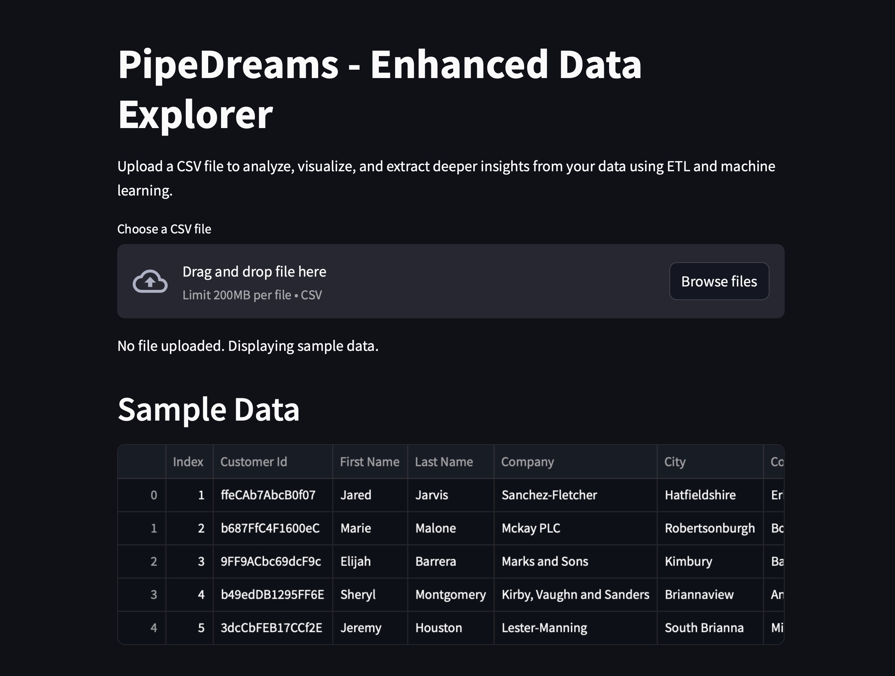

# PipeDreams - CSV Data Explorer


PipeDreams is a data exploration and visualization tool designed to be simple, flexible, and powerful. Upload any CSV file, perform basic ETL transformations, visualize your data, and gain insights with built-in machine learning—all from a user-friendly Streamlit interface. If no file is uploaded, a default dataset (`customers-100000.csv`) is used for demonstration.

## Features

- **CSV Upload**: Upload any CSV file for immediate analysis and visualization.
- **Default Dataset**: If no file is uploaded, the app loads a sample dataset (`customers-100000.csv`) located in the `data/` directory.
- **ETL Transformations**: Clean and transform data, remove missing values, and auto-convert data types.
- **Data Visualization**: Interactive charts (scatter, bar, line, histogram, and box plots) to gain insights from your data.
- **Clustering Analysis**: Use KMeans clustering to identify natural groupings within the data, helping to segment and classify.
- **Predictive Analysis**: A synthetic column (`Annual Purchase Amount`) is included for testing linear regression, allowing users to explore predictive analysis features.

## Getting Started with Docker

You can run PipeDreams using Docker to avoid setting up dependencies locally. The pre-built Docker image is available on [DockerHub](https://hub.docker.com/repository/docker/anuclei/pipedreams).

### Pulling the Docker Image

Pull the latest Docker image from DockerHub:

```bash
docker pull anuclei/pipedreams:latest
```

### Running the Docker Container

Run the application with Docker, exposing it on port 8501:

```bash
docker run -p 8501:8501 anuclei/pipedreams:latest
```

Once the container is running, open your browser and go to `http://localhost:8501` to access the application.

## Kubernetes Deployment

PipeDreams can also be deployed on a Kubernetes cluster. This deployment scenario uses Minikube for local Kubernetes clusters and includes configurations for high availability and autoscaling.

For detailed instructions and YAML configurations, refer to the [Kubernetes Deployment Guide](k8s/k8s.md) in the `k8s` directory.

## Manual Installation

If you prefer not to use Docker, you can set up the app manually.

### Prerequisites

- **Python** (version 3.6 or higher)

### Installation

1. **Clone the repository**:
   ```bash
   git clone https://github.com/markjacksonfishing/pipedreams.git
   cd pipedreams
   ```

2. **Set up a virtual environment**:
   - **MacOS/Linux**:
     ```bash
     python3 -m venv venv
     source venv/bin/activate
     ```
   - **Windows**:
     ```bash
     python -m venv venv
     .\venv\Scripts\activate
     ```

3. **Install dependencies**:
   ```bash
   pip install -r requirements.txt
   ```

4. **Run the application**:
   - **MacOS/Linux**:
     ```bash
     source venv/bin/activate
     streamlit run app.py
     ```
   - **Windows**:
     ```bash
     .\venv\Scripts\activate
     streamlit run app.py
     ```

   The application will open in your default web browser at `http://localhost:8501` and will look like this:


5. **Deactivate the virtual environment** (when finished):
   ```bash
   deactivate
   ```

## How to Use

1. Start the application by following the setup steps above (or run it via Docker).
2. **Upload a CSV file** using the file uploader in the app, or view the **default dataset** if no file is uploaded.
3. Explore the data with built-in ETL transformations and interactive visualizations.
4. Perform **clustering analysis** and **predictive analysis** on available data.

### Advanced Insights: Clustering and Predictive Analysis

- **Clustering Analysis**: Select features for clustering, and the app will automatically group data into clusters using KMeans. This can reveal natural groupings in the data, such as customer segments.
- **Predictive Analysis**: Select features and a target variable (e.g., the synthetic `Annual Purchase Amount`) for linear regression. The app will generate a prediction model, display a mean squared error metric, and show an interactive scatter plot comparing actual vs. predicted values.

### Default Dataset: `customers-100000.csv`

The default dataset, `customers-100000.csv`, is located in the `data/` directory. If no CSV file is uploaded, this dataset will automatically load, allowing users to test the ETL transformations, visualizations, clustering, and predictive analysis features without needing their own data file.
